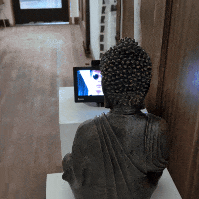

# Buddha Watching You Watching TV 😇

Buddha Watching You Watch TV is a contemporary take on Nam June 
Paik's classic TV Buddha. Tested and ready for a gallery setting.

## Setup

- `git clone git@github.com:camoverride/buddha.git`
- `cd buddha`
- `python3 -m venv .venv`
- `source .venv/bin/activate`
- `pip install -r requirements.txt`
- `sudo apt-get install unclutter`

## Test

- `python run_display.py`

## Run

Start a system service:

- `mkdir -p ~/.config/systemd/user`
- `cat display.service > ~/.config/systemd/user/display.service`
- `systemctl --user daemon-reload`
- `systemctl --user enable display.service`
- `systemctl --user start display.service`
- `sudo loginctl enable-linger $(whoami)`
- `journalctl --user -u display.service`

Clear logs:

- `sudo journalctl --unit=display.service --rotate`
- `sudo journalctl --vacuum-time=1s`
